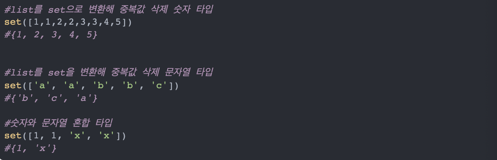
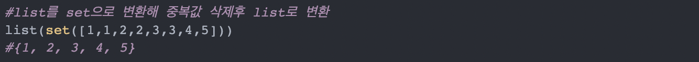

# Python 리스트 중복 제거 set() 함수

> set 중복제거

set은 중복 요소를 허용하지 않기 때문에 중복 값이 삭제된다.

> set에서 list로 다시 변환

set을 사용해 중복 값을 제거하고 다시 리스트 형태로 변환해 줘야 합니다.

list() 함수에 중복 값을 제거한 set을 대입시켜주면 list로 변환이 됩니다.

### CODE

num_list = [3, 3, 2, 1, 5, 1, 4, 2, 3]

print(set(num_list)) 
### {1, 2, 3, 4, 5}

print(list(set(num_list)))
### [1, 2, 3, 4, 5]