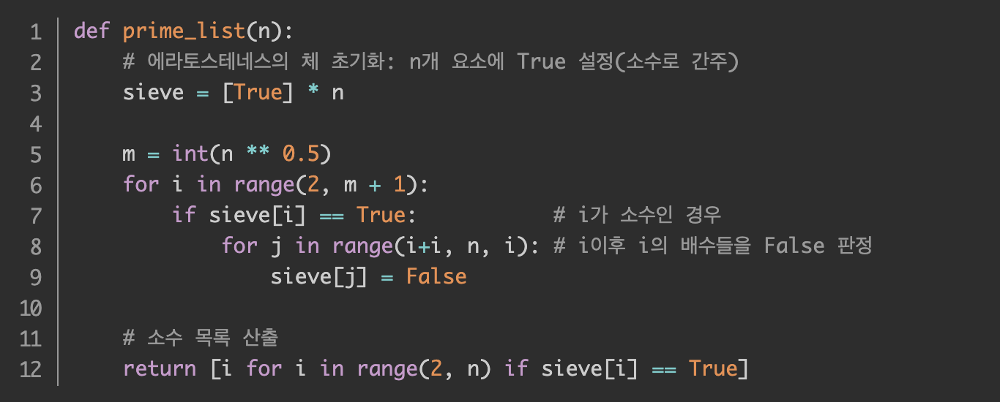
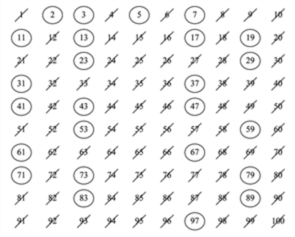

# 에라토스테네스의 체 : 

## 범위에서 합성수를 지우는 방식으로 소수를 찾는 방법.
 1. 1은 제거 
 2. 지워지지 않은 수 중 제일 작은 2를 소수로 채택하고, 나머지 2의 배수를 모두 지운다. 
 3. 지워지지 않은 수 중 제일 작은 3을 소수로 채택하고, 나머지 3의 배수를 모두 지운다. 
 4. 지워지지 않은 수 중 제일 작은 5를 소수로 채택하고, 나머지 5의 배수를 모두 지운다.
  5. (반복)

## Code>

## 에라토스테네스의 체>

> Sieve[i] = True라고 가정했을 때 i는 리스트 인덱스로 0부터 시작하는게 아닌 Sieve[2]는 숫자 2를 가리킨다.