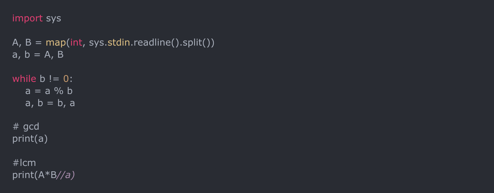

# 최대공약수(GCD : Greatest Common Divisor)

유클리드 호제법은 GCD를 쉽게 구할 수 있는 알고리즘 중의 하나이다. 이 알고리즘은 식을 간결하게 해주는 특징이 있다. 두 수 a와 b (a > b)가 있다고 할 때, a와 b의 최대공약수 G는 b와 a%b(a를 b로 나눈 나머지)의 최대공약수 G'과 서로 같다.

예시 입력으로 보면,

gcd(24, 18) = gcd(18, 6) = gcd(6, 0)인 것이다!

여기서 b가 0이 되는 순간의 6이 바로 최대공약수가 된다.

# 최소공배수(LCM : Least Common Multiple)

이렇게 최대공약수를 쉽게 구하면, 최소공배수는 바로 구할 수 있다. 여기서 두 수 A와 B가 있다고 할 때, A와 B는 각각 x*gcd(a, b), y*gcd(a, b)이다. 따라서 A*B/gcd(a, b)를 해주면 최소공배수가 된다. 이 수가 최소공배수인 이유는 이 수를 A로 나눠도 나누어 떨어지고 B로 나눠도 나누어떨어지는 수 중에서 가장 작은 수이기 때문이다.

