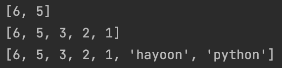

# 리스트 메서드 append, insert, remove, pop, extend

## list.append(x) - 리스트에 값 추가

리스트의 append 함수를 이용해서 리스트의 끝에 값 x를 추가하는 함수 입니다.

a = [2, 9, 4]  
print(a)
 
a.append('k')  
print(a)
 
a.append(100)  
print(a)

## list.insert(a, b) - 특정 위치에 값 추가

c = [22, 44, 66, 88]
print(c)
 
c.insert(0, 'k')  
print(c)
 
c.insert(3, 'm')  
print(c)

## list.pop() - 리스트 맨 마지막 값 반환 후 삭제

리스트에 있는 맨 마지막 값을 반환한 후에 리스트에서 해당 값을 삭제하는 함수 입니다.

## list.extend(list2) - 리스트에 다른 리스트2 연결

리스트1에 리스트2를 붙이고 싶을때 사용하는 함수 입니다.
extend( 매개변수 ) 함수의 매개변수에는 무조건 리스트가 와야합니다.

a = [6, 5]

b = [3, 2, 1]

c = ['blockdmask', 'blog'] 
print(a)
 
a.extend(b)  
print(a)
 
a.extend(c)  
print(a)

> 리스트 + 연산자와 extend의 차이

list1 + list2 는 리스트 두개의 리스트를 연결해서 새로운 list3을 반환하는 것이고 그렇기 때문에 list3 = list1 + list2 이런식으로 해야 이어진 리스트를 받을 수 있습니다.  
list1.extend(list2)는 list1 리스트 객체에다가 list2를 붙이고, list1 객체를 그대로 사용할 수 있다는 점이 다릅니다.

# 파이썬 정렬 sorted 함수 정리

> ** 리스트.sort()와 sorted(리스트)의 가장 큰 차이는
리스트.sort() 는 본체의 리스트를 정렬해서 변환하는 것이고,
sorted(리스트) 는 본체 리스트는 내버려두고, 정렬한 새로운 리스트를 반환하는 것입니다.

a = [2, 4, 1, 9, 100, 29, 40, 10]  
b = sorted(a)  
c = sorted(a, reverse=True)
 
print(f'origin                  : {a}')
print(f'sorted(a)               : {b}')
print(f'sorted(a, reverse=True) : {c}')

리스트 자체 함수인 sort는 해당 리스트를 정렬하는 것과 달리
sorted 함수는 정렬한 새로운 리스트를 반환하는 것을 볼 수 있습니다.

정렬된 리스트 = sorted(기존 리스트)

또한, sorted 함수의 reverse 파라미터(옵션)를 True로 변경하면 내림차순으로 정렬하는 것을 볼 수 있습니다.

