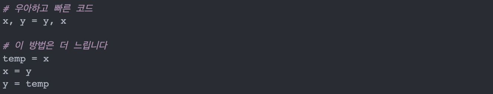
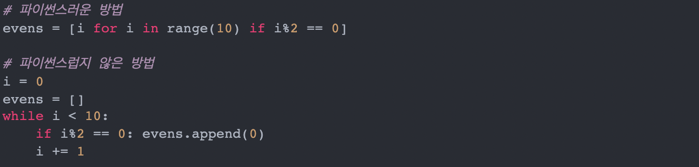

1. 긴 문자열을 합칠 때는 join() 사용>

여러 문자열들을 합칠 때 "+"를 사용할 수 있습니다. 파이썬에서 string은 immutable하기 때문에, "+"연산을 할 때 새 문자열을 만들고 기존 내용을 복사해야합니다. join()을 사용하십시오.

2. 변수를 swap할 때는 다중할당을 사용>

3. List Comprehension을 사용

List Comprehension은 파이썬 인터프리터가 루프를 돌면서 예측 가능한 패턴을 발견할 수 있게 최적화되어 있어서 더 빠릅니다.

또한 List Comprehension은 가독성이 뛰어나고(functional programming), 대부분의 경우 카운팅을 위한 하나의 변수만을 저장합니다.

